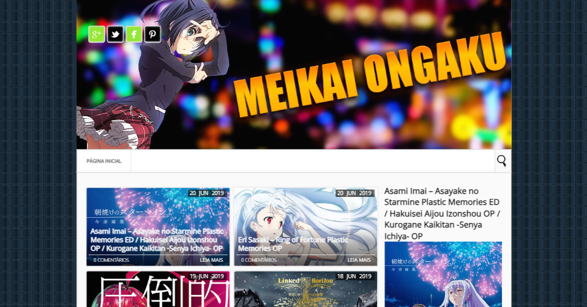

<div align="center">
  <h1>Blogger-MeikaiOngaku</h1>
  <p>Template no formato XML para o CMS Blogger com tema de musicas Anime, Games e cultura Geek em geral.</p>
  
</div>

# 📒 Índice
* [Descrição](#descrição)
* [Requisitos Funcionais](#requisitos)
* [Tecnologias](#tecnologias)
* [Design](#design)
  * [Cores](#cores)
  * [Fontes](#fontes)
* [Instalação](#instalação)
* [Licença](#licença)

# 📃 <span id="descrição">Descrição</span>
Template no formato XML para o CMS Blogger com tema de musicas Anime, Games e cultura Geek em geral, utilizando conceitos de responsividade para formatos de desktop e mobile com CSS nativo.

# 📌 <span id="requisitos">Requisitos Funcionais</span>
- [x] Responsividade<br>

# 💻 <span id="tecnologias">Tecnologias</span>
- **HTML**
- **CSS**
- **JavaScript**

# 🎨 <span id="design">Design</span>
- O modelo final para versão desktop e mobile está disponível na pasta `./design`

- <span id="cores">Cores<br></span>
  * #FAFAFA<br>
  * #595959<br>
  * #FFD269<br>
  * #F4F1E9<br>
  * #FFFFFF<br>

- <span id="fontes">Fontes<br></span>
  * Segoe UI Semilight, Open Sans, Verdana, Arial, Helvetica, sans-serif

# 🚀 <span id="instalação">Instalação</span>
```bash
  # Clone este repositório:
  $ git clone https://github.com/CleilsonAndrade/blogger-meikaiongaku.git
  $ cd ./blogger-meikaiongaku
```

# 📝 <span id="licença">Licença</span>
Esse projeto está sob a licença MIT. Veja o arquivo [LICENSE](LICENSE) para mais detalhes.

---

<p align="center">
  Feito com 💜 by CleilsonAndrade
</p>